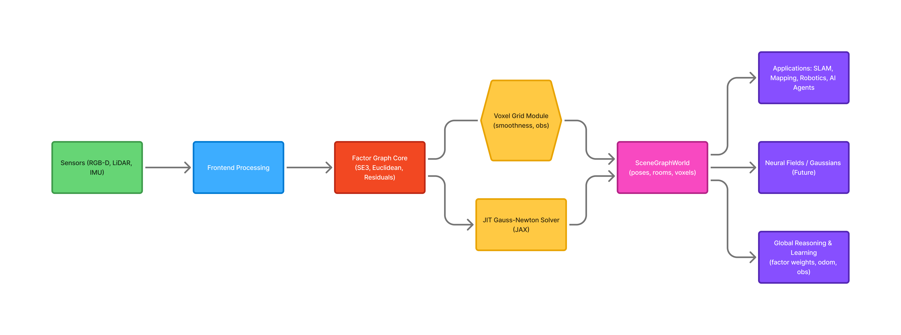

# DSG-JIT

*A JIT-compiled, differentiable 3D Dynamic Scene Graph engine for SLAM, neural fields, and world-modeling.*

---


---

## What is DSG-JIT?

Modern spatial intelligence systems are fractured:

- **SLAM** handles metric consistency  
- **Neural fields / Gaussians** handle appearance & dense geometry  
- **Scene graphs** handle semantic structure & relationships  
- **Optimizers** handle consistency, often as a separate non-differentiable backend  

**DSG-JIT unifies all of these into one system:**

> A JIT-compiled, differentiable engine that builds, optimizes, and reasons over a 3D world model in real time.

This repository provides:

- A **differentiable factor-graph core** (SE3 + Euclidean)
- A **SceneGraphWorld** layer for poses, places, rooms, voxels
- **Voxel grid with smoothness + observation factors**
- **Learnable parameters** (odom, voxel obs, factor weights)
- **JIT-compiled solvers** (JAX Gauss–Newton on manifolds)
- A full suite of **tests, experiments, and benchmarks**

This forms the foundation for a future **differentiable Dynamic Scene Graph world model.**

---

## High-Level Architecture



DSG-JIT is organized into five conceptual layers:

### 1. Sensor Frontend  
Processes raw sensor data (RGB-D, LiDAR, IMU) into:
- Depth / point clouds
- Frame-to-frame motion
- Optional semantics

### 2. JIT-Compiled SLAM Backend  
A differentiable factor graph performing:

- Pose optimization on SE3 manifolds  
- Loop closure / chain constraints  
- Learnable factor-type weights  
- Fully JIT-compiled Gauss–Newton  

### 3. Neural Field Module *(future integration)*  
To support:

- NeRF / Gaussian splatting  
- Photometric residuals  
- Dense geometry for segmentation  

### 4. Dynamic 3D Scene Graph Layer  
SceneGraphWorld tracking:

- Poses, places, rooms, agents  
- Attachments and voxel embeddings  
- Geometry + semantics as a single structure  

### 5. Global Optimization & Reasoning  
Unified optimization across:

- Trajectories  
- Voxels  
- Scene graph structure  
- Learnable factors  

For more detail, see the full architecture page:  
➡️ `architecture.md`

---

## Quickstart

### Clone and install

```bash
git clone https://github.com/TannerTorrey3/DSG-JIT.git
cd DSG-JIT

python3 -m venv venv
source venv/bin/activate  # Windows: venv\Scripts\activate

pip install -r requirements.txt

export PYTHONPATH=src
```

---

## Run Tests

To verify your installation, run:

```bash
pytest -q
```

You should see all tests passing.

---

## First Example

Run a simple dynamic trajectory experiment:

```bash
python experiments/exp06_dynamic_trajectory.py
```

Additional examples are available in:

➡️ `examples.md`

---

## Current Capabilities

### ✔ Differentiable Factor Graph Engine  
- SE3 manifolds  
- Euclidean variables  
- Priors, odometry, attachments  
- Voxel smoothness & observation residuals  

### ✔ JIT-Compiled Solvers  
- Gauss–Newton  
- Manifold-aware retractors  
- Significant runtime speedups  

### ✔ SceneGraphWorld  
- Poses, places, rooms  
- Agents & trajectories  
- Attachments  
- Voxel embedding layer  

### ✔ Learnable Components  
- Odom measurements  
- Voxel observation points  
- Factor-type weights  
- Hybrid SE3 + voxel joint learning  

### ✔ Benchmarks  
- SE3 chain (200 poses): **51 ms (JIT)** vs **376,098 ms (no JIT)**  
- Voxel chain (500 voxels): **96 ms (JIT)** vs **3,044 ms (no JIT)**  
- Hybrid SE3 + voxel (50 poses, 500 voxels): **149 ms (JIT)** vs **97,500 ms (no JIT)**  

Benchmarks available at:
➡️ `benchmarks.md`

---

## Roadmap Overview

### Phase 1 — Core Framework ✔  
Types, manifolds, solvers

### Phase 2 — SE3 + Scene Graph Prototype ✔  
Pose chains, dynamic graph, places/rooms

### Phase 3 — Voxel Integration ✔  
Voxel grids, smoothness, observation learning

### Phase 4 — Unified Learning Engine ✔  
Factor-type weights, odom learning, hybrid experiments

### Phase 5 — Scaling & Real-World Validation 🚧  
Benchmarks, documentation, dataset connectors

Details:  
➡️ `roadmap.md`

---

## Project Structure

```text
dsg-jit/
  src/
    core/            # FactorGraph, math3d, types
    optimization/    # Solvers + JIT wrappers
    slam/            # Residuals, manifolds, SE3 ops
    scene_graph/     # Relations, entities
    world/           # SceneGraphWorld, training, voxel grid
    telemetry/       # Anonymous usage analytics
  tests/             # 26 test files
  experiments/       # Exp01–Exp16 (hero experiments)
  benchmarks/        # Performance comparisons
  docs/              # MkDocs documentation
  README.md
```

---

## Who Is DSG-JIT For?

- Robotics & SLAM researchers  
- 3D scene graph / geometric reasoning labs  
- NeRF / Gaussian splatting researchers  
- Embodied AI teams building world models  
- Anyone who needs a differentiable 3D optimizer  

---

## Get Involved

Contributions welcome!
Open a PR or file an issue on GitHub.

---